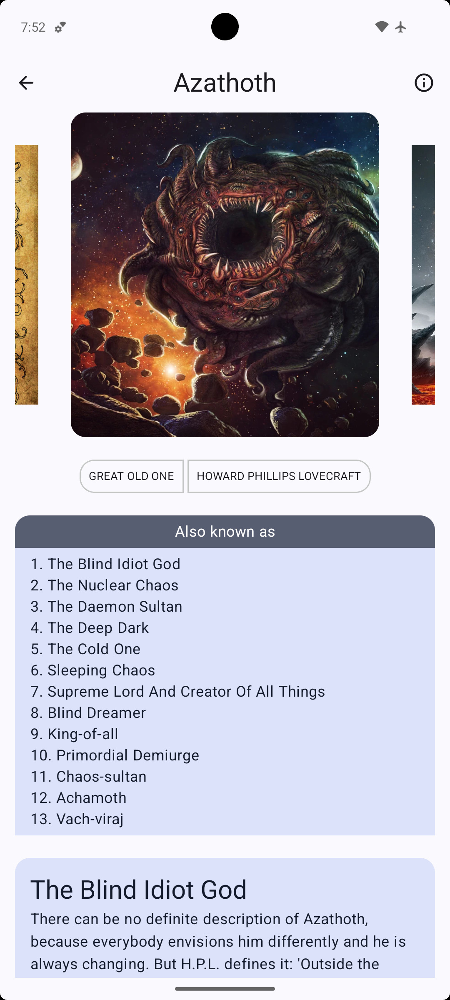
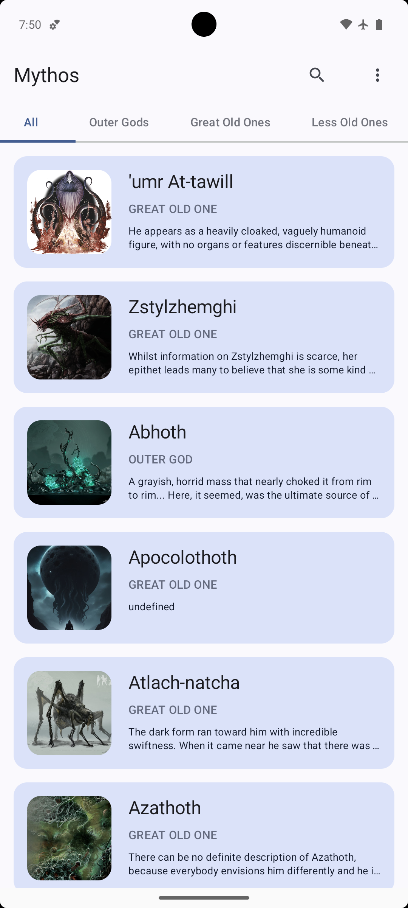
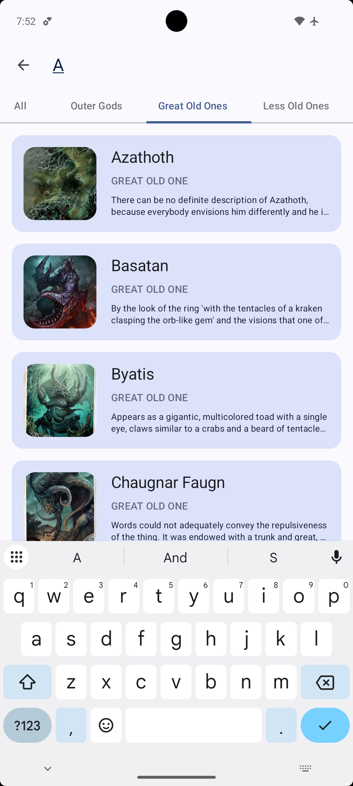
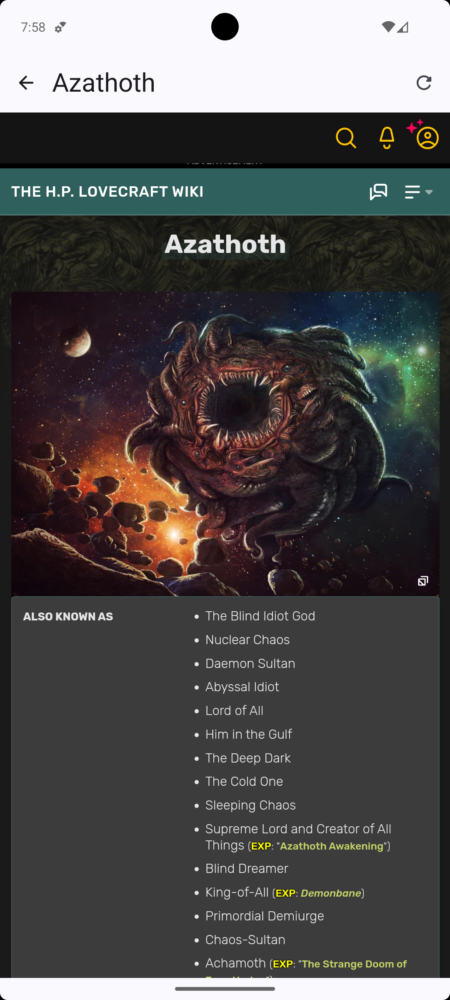

# Mythos

An Android app built with Jetpack Compose to display a list of creatures in the Cthulhu Mythos. It supports offline data, image caching, and WebView integration.

## Set up🏗️
### 1. Clone project
```bash
git clone https://github.com/NhuHuy-79/cthuhul-api-app.git
cd cthuhul-api
```
## Screenshots📸
| Detail Screen | Home Screen |
|:-------------:|:-----------:|
|  |  |

| Search Screen | WebView |
|:-------------:|:-------:|
|  |  |

### 2. Requirement
- JDK 17+
- Gradle 8+
- Internet connection

## Features✨
- View creatures by category (Outer Gods, Great Old Ones, Lesser Old Ones)
- Search creatures by name
- Offline image caching
- Room database for offline data
- Webview for external data

## Tech stacks🛠️
- [Jetpack Compose](https://developer.android.com/jetpack?gad_source=1&gad_campaignid=21831783735&gbraid=0AAAAAC-IOZmJHXOnYxJT0VPiVTt4osT_Y&gclid=CjwKCAjwy7HEBhBJEiwA5hQNonEly8p2bGiJ_cBj8WlsO9PLCF0voKnfQ6BTw3XeRaq1augmVJ5LthoCUlwQAvD_BwE&gclsrc=aw.ds)
- [Room Database](https://developer.android.com/training/data-storage/room)
- [Hilt/ Dagger](https://developer.android.com/training/dependency-injection/hilt-android?hl=vi)
- [Retrofit](https://square.github.io/retrofit/)
- [Coil](https://coil-kt.github.io/coil/compose/)
- [Jetpack Navigation](https://developer.android.com/develop/ui/compose/navigation?hl=vi)
##  Credits🧾
This project uses data from a public Lovecraft Mythos API.  
We sincerely thank the original creator for making this data accessible.

🔗 [API Source](https://lovecraftapirest.fly.dev/)
